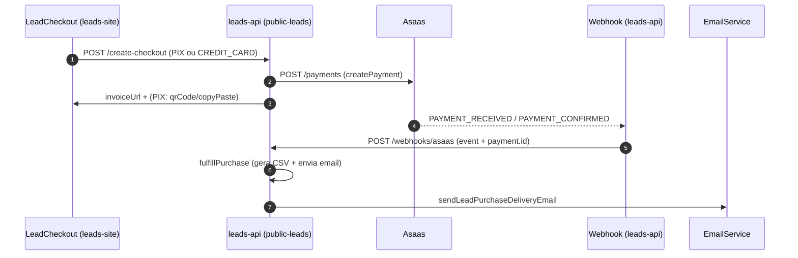

# Lead Rápido API (Checkout de Leads) - Documentação Própria

Este documento descreve a API do serviço `leads-api` para compra de leads (checkout público), incluindo fluxo de pagamento via Asaas (PIX e cartão de crédito), webhook e entrega.

## Base URL

- Saúde: `GET /health` e `GET /api/v1/health`
- Checkout público (carregamento, cálculo e pagamento): `GET/POST /api/v1/public-leads/*`

Exemplo de base:

- `http://localhost:3000/api/v1/public-leads`

## Endpoints

### 1) Health Check

`GET /health`  
`GET /api/v1/health`

Resposta (exemplo):

```json
{
  "status": "healthy",
  "timestamp": "2026-03-25T12:34:56.000Z",
  "service": "leadrapidos-api",
  "version": "1.0.0"
}
```

### 2) Catálogo

`GET /api/v1/public-leads/catalog`

Retorna os estados disponíveis e, para cada estado, seus segmentos.

Resposta (exemplo):

```json
{
  "success": true,
  "unitPrice": 0.01,
  "minimumAmount": 0,
  "states": [
    {
      "state": "SP",
      "segments": [
        { "segment": "auto peças", "availableLeads": 12265 }
      ]
    }
  ]
}
```

### 3) Quote (cálculo + disponibilidade)

`GET /api/v1/public-leads/quote?state=SP&segment=Padaria&couponCode=DESC10`

Query:

- `state` (string, obrigatório)
- `segment` (string, obrigatório)
- `couponCode` (string, opcional)

Resposta (exemplo):

```json
{
  "success": true,
  "state": "SP",
  "segment": "Padaria",
  "unitPrice": 0.01,
  "minimumAmount": 0,
  "availableCount": 2000,
  "grossAmount": 20,
  "discountAmount": 0,
  "couponCode": null,
  "chargedAmount": 20,
  "minimumApplied": false
}
```

Notas de regra de negócio (implementadas no código):

- Preço unitário atual: `UNIT_PRICE = 0.01` (R$ 0,01 por lead)
- Não existe mínimo fixo relevante no cálculo (`MIN_AMOUNT = 0`)
- Para `quote`, o campo `minimumApplied` está presente mas tende a ser `false` devido a `MIN_AMOUNT = 0`.

### 4) Criar Checkout

`POST /api/v1/public-leads/create-checkout`

Content-Type: `application/json`

#### Request body (campos)

Campos do comprador e filtros:

- `buyerName` (string, obrigatório, mínimo 3 caracteres)
- `buyerEmail` (string, obrigatório, precisa conter `@`)
- `buyerWhatsapp` (string, obrigatório; valida 10 ou 11 dígitos após remover não-numéricos)
- `state` (string, obrigatório)
- `segment` (string, obrigatório)
- `quantity` (number, obrigatório; inteiro > 0)

Pagamento:

- `paymentMethod` (string, obrigatório)
  - `PIX`
  - `CREDIT_CARD`

Documento/endereço:

- `cpfCnpj` (string, enviado ao Asaas; validado com cartão)
- `cep` (string, enviado ao Asaas; validado com cartão)
- `addressNumber` (string, enviado ao Asaas; validado com cartão)
- `endereco` (string, opcional no backend; enviado ao Asaas como endereço)
- `bairro` (string, opcional no backend; usado em `addressComplement`)
- `cidade` (string, opcional no backend; usado em `addressComplement`)
- `uf` (string, opcional no backend; usado como `province`)

Cupom:

- `couponCode` (string, opcional)

Cartão (obrigatório apenas quando `paymentMethod = CREDIT_CARD`):

- `creditCard` (object)
  - `holderName` (string)
  - `number` (string)
  - `expiryMonth` (string/number)
  - `expiryYear` (string/number)
  - `ccv` (string)

#### Exemplos

##### Exemplo: PIX

```json
{
  "buyerName": "João da Silva",
  "buyerEmail": "joao@empresa.com",
  "buyerWhatsapp": "(11) 99999-9999",
  "state": "SP",
  "segment": "Padaria",
  "quantity": 200,
  "paymentMethod": "PIX",
  "cpfCnpj": "12345678900",
  "cep": "01001000",
  "addressNumber": "123",
  "endereco": "Rua Exemplo",
  "bairro": "Centro",
  "cidade": "São Paulo",
  "uf": "SP",
  "couponCode": "DESC10"
}
```

##### Exemplo: Cartão de Crédito

```json
{
  "buyerName": "João da Silva",
  "buyerEmail": "joao@empresa.com",
  "buyerWhatsapp": "(11) 99999-9999",
  "state": "SP",
  "segment": "Padaria",
  "quantity": 200,
  "paymentMethod": "CREDIT_CARD",
  "cpfCnpj": "12345678900",
  "cep": "01001000",
  "addressNumber": "123",
  "endereco": "Rua Exemplo",
  "bairro": "Centro",
  "cidade": "São Paulo",
  "uf": "SP",
  "creditCard": {
    "holderName": "JOAO DA SILVA",
    "number": "4111111111111111",
    "expiryMonth": "12",
    "expiryYear": "2030",
    "ccv": "123"
  },
  "couponCode": "DESC10"
}
```

#### Resposta (exemplo)

```json
{
  "success": true,
  "purchaseId": "lp_1710000000000",
  "paymentId": "pay_12345",
  "paymentStatus": "PENDING",
  "invoiceUrl": "https://...",
  "chargedAmount": 20,
  "grossAmount": 20,
  "discountAmount": 0,
  "couponCode": "DESC10",
  "minimumApplied": false,
  "pix": {
    "qrCodeImage": "data:image/png;base64,...",
    "copyPaste": "000201..."
  }
}
```

Observações:

- `pix` é preenchido quando `paymentMethod = PIX`.
- Em situações onde o pagamento já chega como pago (`paymentStatus` em `RECEIVED`/`CONFIRMED`), o fluxo chama a entrega imediatamente (e o frontend redireciona).

### 5) Status do Pagamento

`GET /api/v1/public-leads/payment-status?paymentId=pay_123`

Resposta:

```json
{
  "success": true,
  "paid": false,
  "status": "PENDING"
}
```

### 6) Webhook Asaas

`POST /api/v1/public-leads/webhooks/asaas`

Header:

- `asaas-access-token`: deve ser igual a `ASAAS_WEBHOOK_SECRET`

Body (parcial, esperado):

```json
{
  "event": "PAYMENT_RECEIVED",
  "payment": { "id": "pay_123", "status": "RECEIVED" }
}
```

Eventos relevantes:

- `PAYMENT_RECEIVED`
- `PAYMENT_CONFIRMED`

Quando um desses eventos chega, o backend atualiza o registro em `data/lead-purchases.json` e executa a entrega.

### 7) Upload Admin (Staging)

`POST /api/v1/public-leads/admin/upload-staging`

Headers:

- `x-admin-token` (string) ou `adminToken` no body

Body (exemplo):

```json
{
  "csvContent": "nome,whatsapp,estado,segmento\n...",
  "delimiter": ",",
  "fileName": "leads.csv"
}
```

Regras:

- Requer Supabase configurado (env de Supabase)
- Insere na tabela `leadrapido_staging`
- Insere em chunks de 500 linhas

## Fluxo de Checkout (Sequência)



## Persistência e Entrega

- O checkout grava um registro em: `leads-api/data/lead-purchases.json`
- O CSV de entrega é gerado em `leads-api/data/lead-exports/`
- A entrega tenta buscar leads reais via Supabase (tabela `leadrapido`). Se falhar, usa fallback sintético.

## Integrações

### Asaas

Usos no checkout:

- `createCustomer` / `findCustomerByEmail`
- `createPayment`
- Para PIX: `getPixQrCode` após criação da cobrança

### Supabase (opcional)

- Contagem/seleção de leads reais e upload admin em `leadrapido_staging`.

## Variáveis de Ambiente (principais)

- `ASAAS_API_URL`, `ASAAS_API_KEY`, `ASAAS_ENVIRONMENT`
- `ASAAS_WEBHOOK_SECRET`, `BYPASS_WEBHOOK_AUTH`
- `LEADRAPIDOS_ADMIN_TOKEN`
- `SUPABASE_URL` e `SUPABASE_SERVICE_KEY`/`SUPABASE_SERVICE_ROLE_KEY` (se quiser features com Supabase)
- SMTP (usado por `EmailService`)
  - `SMTP_HOST`, `SMTP_PORT`, `SMTP_USER`, `SMTP_PASSWORD`
  - `SMTP_FROM_NAME`, `SMTP_FROM_EMAIL` (opcionais; já há defaults no código)

---

## Links úteis (no código)

- Implementação: `leads-api/src/main/controller/PublicLeadCheckoutController.ts`
- Integração Asaas: `leads-api/src/main/infrastructure/services/AsaasService.ts`
- Entrega de email: `leads-api/src/main/infrastructure/services/EmailService.ts`

