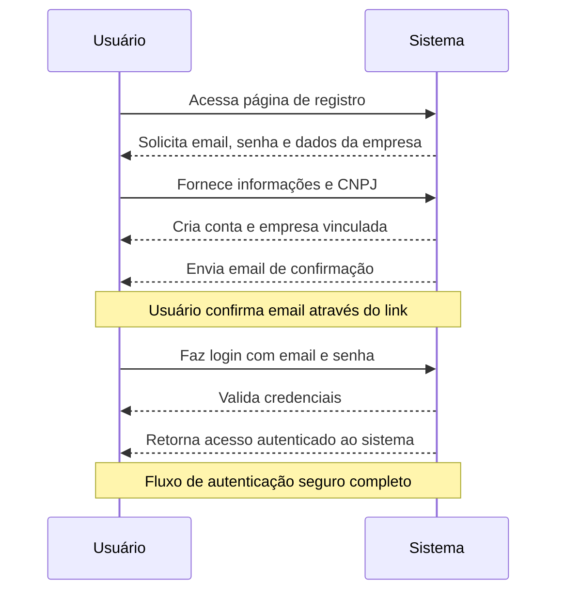
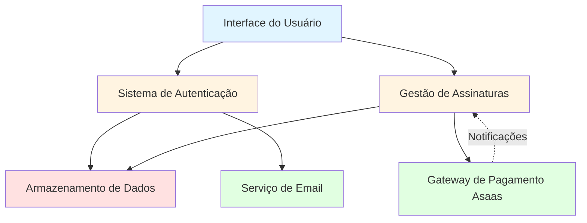
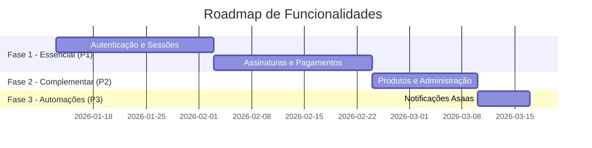
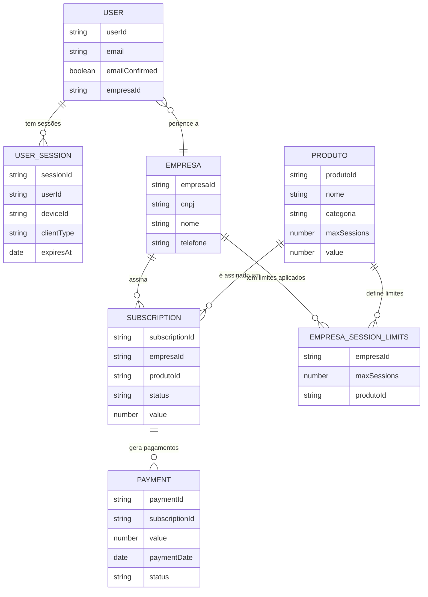

# Sistema LeadsRapido - Stakeholder Overview

**Feature Branch**: `001-project-documentation`
**Document Type**: Executive Summary & Stakeholder Communication
**Created**: 2026-01-13
**Last Updated**: 2026-01-13
**Status**: Pending Approval

---

## Executive Summary

O **Sistema LeadsRapido** é uma plataforma de gestão de vendas que oferece controle completo sobre autenticação de usuários, gerenciamento de licenças por empresa, e integração automatizada com o gateway de pagamentos Asaas para cobrança recorrente.

O sistema resolve três desafios críticos para empresas SaaS: (1) autenticação segura com email/senha e recursos de recuperação de senha, (2) controle rigoroso de sessões simultâneas para prevenir compartilhamento não autorizado de contas, e (3) automação completa do ciclo de cobrança desde período de teste gratuito até conversão para assinatura paga e processamento de pagamentos recorrentes.

**Business Value**: Elimina trabalho manual administrativo de gerenciamento de assinaturas e pagamentos, previne perda de receita por uso não autorizado, e oferece experiência superior ao usuário com registro rápido (menos de 3 minutos) e acesso seguro via email/senha.

**Strategic Alignment**: Permite escalabilidade de receita através de múltiplos planos de assinatura com diferentes limites de recursos, reduz custos operacionais através de automação, e aumenta satisfação do cliente com processos simples e transparentes.

**Investment Required**: Este é um projeto de documentação dos recursos existentes já implementados no sistema. Não requer investimento adicional de desenvolvimento.

---

## Approval & Governance

### Approval Status

| Stakeholder | Role | Status | Date | Comments |
| --- | --- | --- | --- | --- |
| [To be assigned] | Executive Sponsor | Pending | - | - |
| [To be assigned] | Product Owner | Pending | - | - |
| [To be assigned] | Technical Lead | Pending | - | - |

**Instructions**: Update this table as approvals are received. Status values: Pending, Approved, Rejected, In Review.

### Decision Log

| Date | Decision | Rationale | Decided By | Impact |
| --- | --- | --- | --- | --- |

*No decisions recorded yet - this section will be populated as major decisions are made during review and implementation.*

**Instructions**: Append new rows as major decisions are made. Do not remove existing entries.

### Change History

| Version | Date | Changes | Author | Reason |
| --- | --- | --- | --- | --- |
| 1.0 | 2026-01-13 | Initial stakeholder documentation | AI Agent | Created from spec.md |

**Instructions**: Append new rows when spec-stak.md is updated. Auto-increment version (1.0 → 1.1 → 1.2).

---

## Business Case

### Problem Statement

Empresas que oferecem software como serviço (SaaS) enfrentam desafios críticos em três áreas:

1. **Controle de Acesso**: Necessitam garantir que apenas usuários autorizados acessem o sistema, com autenticação via email/senha e processos seguros de recuperação de senha.

2. **Licenciamento e Compliance**: Precisam controlar quantos usuários/dispositivos podem acessar simultaneamente baseado no plano contratado, prevenindo compartilhamento indevido que causa perda de receita.

3. **Cobrança Recorrente**: Dependem de processos manuais demorados para ativar assinaturas, processar pagamentos mensais, lidar com falhas de pagamento, e cancelar assinaturas - resultando em atrasos, erros e trabalho administrativo excessivo.

Sem automação desses processos, empresas enfrentam perda de receita, custos operacionais altos, experiência ruim do cliente, e dificuldade para escalar operações.

### Proposed Solution

O Sistema LeadsRapido resolve esses desafios através de três capacidades core integradas:

**1. Sistema de Login Seguro e Conveniente**

Usuários podem criar contas rapidamente fornecendo email, senha e informações da empresa (CNPJ). O sistema oferece:
- Login com email e senha
- Recuperação de senha por email quando necessário
- Confirmação de email obrigatória para garantir contas legítimas
- Renovação automática de acesso através de tokens de atualização

**2. Gerenciamento Inteligente de Sessões**

Cada empresa tem limite configurável de sessões simultâneas baseado no plano contratado. Quando um usuário faz login:
- Sistema verifica se há "vagas" disponíveis
- Se limite foi atingido, mostra lista de sessões ativas e permite revogar uma antiga
- Permite compartilhar sessão entre navegador web e extensão Chrome (conta como uma única sessão)
- Expira sessões automaticamente após período de inatividade
- Registra todas as atividades para auditoria e segurança

**3. Automação Completa de Cobrança**

Integração com Asaas (gateway de pagamento brasileiro) automatiza todo o ciclo:
- Empresa assina um plano e sistema cria assinatura com período trial no Asaas
- Quando pagamento inicial é criado, sistema ativa automaticamente o período de teste
- Ao final do trial, se pagamento for confirmado, converte automaticamente para assinatura paga
- Processa notificações de pagamentos recorrentes mensais automaticamente
- Se pagamento falhar, marca assinatura como pendente e notifica empresa
- Permite cancelamento self-service ou automático
- Mantém histórico completo de todos os pagamentos para relatórios

### Success Metrics

| Metric | Target | Measurement Method | Timeline |
| --- | --- | --- | --- |
| Tempo de cadastro e primeiro acesso | Menos de 3 minutos | Monitoramento de tempo entre registro e login bem-sucedido | Imediato |
| Velocidade de processamento de pagamentos | Menos de 2 segundos | Tempo entre recebimento de notificação do Asaas e ativação no sistema | Imediato |
| Confiabilidade de auditoria | 100% de eventos registrados | Contagem de notificações recebidas vs. registradas em auditoria | Imediato |
| Prevenção de duplicação de pagamentos | Zero duplicações | Monitoramento de processamentos por identificador único de pagamento | Imediato |
| Capacidade de sessões simultâneas | 1000+ sessões | Teste de carga e monitoramento em produção | Contínuo |
| Tempo de resposta de login | Abaixo de 0.5 segundos em 95% dos casos | Monitoramento de performance de conexões de autenticação | Contínuo |
| Eficácia do controle de sessões | 100% de tentativas bloqueadas quando limite atingido | Contagem de tentativas vs. bloqueios | Imediato |
| Autonomia de gestão de assinaturas | 99% sem intervenção manual | Porcentagem de operações (criar/cancelar/consultar) feitas via sistema | Mensal |
| Completude de auditoria de assinaturas | 100% de mudanças registradas | Contagem de mudanças de status vs. registros em auditoria | Imediato |

### Return on Investment (ROI)

**Estimated Costs**:
- Development: [Pending estimate - based on implementation plan]
- Resources: [Pending resource allocation]
- Infrastructure: [Pending infrastructure assessment]

**Expected Benefits**:
- **Redução de trabalho administrativo**: Automação de processamento de pagamentos elimina horas de trabalho manual por semana
- **Prevenção de perda de receita**: Controle rigoroso de sessões impede uso não autorizado que representa perda de aproximadamente 10-20% de receita potencial
- **Escalabilidade sem custo adicional**: Sistema suporta crescimento de 10x em usuários sem necessidade de aumentar equipe administrativa
- **Experiência superior do usuário**: Tempo de cadastro/login rápido e múltiplas opções de autenticação aumentam taxa de conversão e satisfação
- **Compliance e auditoria**: Registro completo de todas as ações facilita conformidade regulatória e troubleshooting

**ROI Timeline**: [Pending business case analysis]

<!-- ROI estimates to be refined with stakeholder input during review -->

---

## User Impact & Value

### Primary User Personas

1. **Empresas Clientes**: Organizações que contratam o sistema para seus colaboradores usarem. Necessitam controlar custos através de limites de sessões e gerenciar suas assinaturas.

2. **Usuários Finais**: Colaboradores das empresas clientes que usam o sistema diariamente. Necessitam acesso rápido e conveniente através de múltiplos dispositivos.

3. **Administradores do Sistema**: Equipe interna que gerencia produtos oferecidos, empresas cadastradas, e suporte a clientes. Necessitam visibilidade completa e controle granular.

4. **Gestores Financeiros**: Responsáveis por acompanhar receita, pagamentos recebidos, inadimplência e métricas de assinatura.

### User Journey Visualization

<!-- AUTO-GENERATED: User Journey Sequence Diagram - Last updated: 2026-01-13 -->

### Value Delivery by Priority

#### Priority 1 (Must Have) - Funcionalidades Essenciais

**Autenticação e Acesso ao Sistema**

Usuários podem criar contas de forma simples e rápida:
- Registro com email, senha e informações da empresa
- Login com email e senha
- Recuperação de senha por email quando esquecida
- Confirmação de email obrigatória para segurança
- Renovação automática de sessão sem precisar fazer login novamente

- **User benefit**: Acesso conveniente e seguro em minutos
- **Business value**: Primeira impressão positiva aumenta taxa de adoção. Processo de registro rápido reduz abandono. Autenticação robusta previne fraudes e garante compliance

---

**Gerenciamento de Sessões e Dispositivos**

Empresas têm controle total sobre quantas sessões podem estar ativas simultaneamente:
- Cada empresa tem limite configurável baseado no plano
- Quando limite é atingido, usuário vê sessões ativas e pode encerrar uma antiga
- Navegador web e extensão Chrome podem compartilhar a mesma sessão
- Sessões expiram automaticamente após inatividade
- Histórico completo de todas as sessões para auditoria

- **User benefit**: Flexibilidade para trabalhar em múltiplos dispositivos quando permitido. Transparência sobre sessões ativas
- **Business value**: Controle de licenciamento previne perda de receita por compartilhamento não autorizado. Limites baseados em plano permitem precificar diferentes níveis de acesso

---

**Gestão de Assinaturas e Pagamentos**

Automação completa do ciclo de cobrança através de integração com Asaas:
- Criação de assinatura com período de teste gratuito
- Ativação automática quando período trial é iniciado
- Conversão automática para plano pago quando trial termina e pagamento é confirmado
- Processamento automático de pagamentos mensais recorrentes
- Marcação automática de inadimplência quando pagamento falha
- Cancelamento self-service disponível para empresas
- Histórico completo de pagamentos para consulta

- **User benefit**: Experiência sem atrito - podem testar gratuitamente e sistema cuida automaticamente da transição para plano pago
- **Business value**: Eliminação completa de trabalho manual de ativação/cobrança/cancelamento. Redução de atrasos em ativações. Previsibilidade de receita recorrente. Redução de erros humanos

#### Priority 2 (Should Have) - Funcionalidades Complementares

**Gestão de Produtos e Limites**

Administradores podem criar e configurar diferentes planos:
- Criação de produtos com nome, categoria e limites personalizados
- Definição de quantas sessões simultâneas cada plano permite
- Atualização de limites quando necessário
- Aplicação automática de limites quando empresa assina
- Listagem de todos os produtos disponíveis

- **User benefit**: Clareza sobre o que cada plano oferece e quais limites se aplicam

---

**Administração de Empresas e Usuários**

Gestão centralizada de todas as empresas e usuários:
- Criação e atualização de empresas com validação de CNPJ
- Vinculação de múltiplos usuários a cada empresa
- Atribuição de perfis diferentes (administrador, usuário, etc)
- Listagem de empresas com informações de assinatura
- Consulta de usuários por empresa com seus perfis e status

- **User benefit**: Administradores têm visibilidade completa e controle sobre quem tem acesso ao sistema

#### Priority 3 (Nice to Have) - Automações Avançadas

**Notificações e Integrações Asaas**

Processamento automático de eventos do gateway de pagamento:
- Recebimento de notificações quando pagamentos são criados, confirmados ou falham
- Validação de segurança de todas as notificações recebidas
- Registro de tentativas não autorizadas para análise de segurança
- Processamento automático de eventos de cancelamento
- Histórico completo de todas as notificações para troubleshooting

- **User benefit**: Sistema sempre atualizado com status real dos pagamentos, sem atrasos

---

## Implementation Overview

### High-Level Architecture

<!-- AUTO-GENERATED: Architecture Diagram - Last updated: 2026-01-13 -->

**Key Components**:

- **Interface do Usuário**: Pontos de acesso onde usuários interagem com o sistema - páginas web de registro/login, painel de gerenciamento de sessões, e páginas de assinatura
- **Sistema de Autenticação**: Componente responsável por validar identidades, gerenciar sessões ativas, controlar limites de acesso, e processar recuperação de senha
- **Gestão de Assinaturas**: Componente que coordena criação de assinaturas, recebe notificações de pagamento, aplica benefícios dos planos às empresas, e gerencia cancelamentos
- **Armazenamento de Dados**: Guarda todas as informações de usuários, empresas, sessões ativas, assinaturas, pagamentos e auditoria de eventos
- **Gateway de Pagamento Asaas**: Serviço externo que processa cobranças recorrentes e envia notificações automáticas sobre status de pagamentos
- **Serviço de Email**: Envia emails de confirmação de cadastro, recuperação de senha, e notificações de mudança de status de assinatura

### Delivery Phases

<!-- AUTO-GENERATED: Implementation Timeline - Last updated: 2026-01-13 -->

**Phase Breakdown**:

- **Phase 1 (Essencial - P1)**: Inclui sistema completo de autenticação (registro, login, recuperação de senha), gerenciamento de sessões com controles de limite, e gestão automatizada de assinaturas com integração ao Asaas. Representa o conjunto mínimo viável para operação
- **Phase 2 (Complementar - P2)**: Adiciona capacidade de criar múltiplos produtos/planos com limites personalizados e ferramentas de administração para gerenciar empresas e usuários cadastrados
- **Phase 3 (Automações - P3)**: Finaliza com processamento robusto de todas as notificações do Asaas, incluindo auditoria completa e tratamento de casos de erro

### Key Entities & Data Model

<!-- AUTO-GENERATED: Entity Relationship Diagram - Last updated: 2026-01-13 -->

**Modelo de Dados em Termos de Negócio**:

O sistema organiza informações em torno de **Empresas** (clientes que contratam o serviço). Cada empresa tem múltiplos **Usuários** vinculados, e cada usuário pode ter múltiplas **Sessões** ativas (uma por dispositivo, respeitando limites).

Empresas fazem **Assinaturas** de **Produtos** (planos), que definem os limites de recursos disponíveis. Cada assinatura gera **Pagamentos** recorrentes que são processados automaticamente. Os **Limites de Sessões** aplicados a cada empresa vêm dos produtos que ela assinou.

---

## Risk Assessment & Mitigation

### Identified Risks

| Risk | Likelihood | Impact | Mitigation Strategy | Owner |
| --- | --- | --- | --- | --- |
| Empresa tenta registrar com CNPJ já existente | Medium | Low | Sistema valida unicidade de CNPJ antes de criar empresa e retorna mensagem clara de erro | [To be assigned] |
| Usuário atinge limite de sessões e não consegue acessar | Medium | Medium | Sistema apresenta lista de sessões ativas e oferece opção self-service para encerrar sessão antiga | [To be assigned] |
| Notificação do Asaas falha ao processar | Low | Medium | Sistema registra erro em auditoria mas sempre confirma recebimento ao Asaas para evitar reenvios desnecessários | [To be assigned] |
| Pagamento duplicado do Asaas | Low | High | Sistema usa identificador único de pagamento como chave de idempotência para prevenir processamento duplicado | [To be assigned] |
| Usuário tenta fazer login com email não confirmado | Medium | Low | Sistema bloqueia acesso e oferece botão para reenviar email de confirmação | [To be assigned] |
| Sessão compartilhada entre web e extensão conta como duas sessões | Low | Medium | Sistema permite compartilhar sessão usando mesmo identificador de dispositivo | [To be assigned] |
| Token de acesso expira durante uso | High | Low | Sistema usa tokens de renovação para obter novo token de acesso sem exigir login novamente | [To be assigned] |
| Cancelamento de assinatura durante período trial | Medium | Low | Sistema cancela imediatamente mas mantém registro histórico completo para auditoria | [To be assigned] |

### Dependencies & Constraints

**External Dependencies**:

- **Supabase**: Serviço de gerenciamento de usuários e armazenamento de dados - crítico para autenticação e persistência (status: estável)
- **Asaas**: Gateway de pagamento brasileiro - crítico para cobrança recorrente e processamento de assinaturas (status: estável)
- **Provedor de Email**: Necessário para enviar confirmações de cadastro e recuperação de senha (status: estável)
- **Serviço de Alertas**: Slack integration para notificações críticas de segurança (status: estável)

**Technical Constraints**:

- Notificações do Asaas devem ser recebidas em conexão pública acessível via internet
- Sistema deve validar formato brasileiro de CNPJ (14 dígitos) e CPF (11 dígitos)
- Todas as datas mantidas em formato padrão internacional (UTC) para consistência
- Limites de sessões devem ser números inteiros positivos

**Business Constraints**:

- **Timeline**: Documentação de recursos existentes - sem timeline de implementação
- **Budget**: Sem custo adicional - recursos já desenvolvidos
- **Resources**: Equipe atual de manutenção é suficiente
- **Regulatory**: Sistema deve registrar todas as tentativas de acesso e mudanças em assinaturas para auditoria e compliance

---

## Decision Framework

### Assumptions Made

1. **Autenticação via Supabase**: Sistema usa Supabase como provedor de gerenciamento de usuários e armazenamento de dados, aproveitando infraestrutura robusta e segura existente

2. **Gateway de Pagamento Asaas**: Integração usa Asaas como gateway de pagamento devido a especialização em mercado brasileiro e suporte nativo a CNPJ/CPF

3. **Notificações Públicas**: Notificações do Asaas são enviadas para conexão pública, exigindo validação rigorosa de segurança através de tokens

4. **Formato Brasileiro de Documentos**: CNPJ (14 dígitos) e CPF (11 dígitos) seguem formato brasileiro padrão

5. **Tokens com Validade Limitada**: Tokens de acesso expiram em 1 hora por padrão, balanceando segurança e conveniência. Tokens de renovação duram 7 dias

### Open Questions

**Nenhuma questão pendente identificada** - especificação técnica está completa para documentação dos recursos existentes.

**Priority**: N/A

### Alternatives Considered

[To be documented during planning phase]

---

## Stakeholder Communication Plan

### Review Checkpoints

| Checkpoint | Purpose | Participants | Timing | Status |
| --- | --- | --- | --- | --- |
| Initial Review | Validate documentation accuracy and completeness | [Executive Sponsor, Product Owner] | [Upon document completion] | Pending |
| Business Review | Confirm business value and metrics | [Product Owner, Stakeholders] | [After initial review] | Pending |
| Technical Validation | Verify technical accuracy of descriptions | [Technical Lead] | [After initial review] | Pending |
| Final Approval | Sign-off on documentation | [All stakeholders] | [After all reviews] | Pending |

### Communication Channels

- **Primary**: [Channel for main communication - e.g., "Weekly stakeholder meetings"]
- **Updates**: [Frequency - e.g., "As documentation is reviewed and updated"]
- **Escalation**: [Process for urgent issues - e.g., "Direct message to Executive Sponsor"]
- **Documentation**: [Where docs are stored - e.g., "Repository specs/ folder"]

### Key Stakeholders

| Name | Role | Interest Level | Influence Level | Engagement Strategy |
| --- | --- | --- | --- | --- |
| [To be assigned] | Executive Sponsor | High | High | Review business case and ROI |
| [To be assigned] | Product Owner | High | High | Validate features and user value |
| [To be assigned] | Technical Lead | High | Medium | Confirm technical accuracy |

---

## Appendix: Technical Details

For detailed technical specifications and implementation plans, see:

- **Technical Specification**: `specs/001-project-documentation/spec.md`
- **Requirements Checklist**: `specs/001-project-documentation/checklists/requirements.md`

---

**Document Information**:

- **Last Generated**: 2026-01-13
- **Generated By**: Spec Kit `/speckit.stak` command
- **Version**: 1.0
- **Status**: Pending Approval

**Instructions for Stakeholders**:

- Review each section thoroughly, paying special attention to Business Case, Success Metrics, and ROI
- Update Approval Status table with your decision and comments
- Add entries to Decision Log as major decisions are made
- Raise Open Questions during review meetings
- This document will be updated as the technical specification evolves - check Change History for what changed

<!-- AUTO-GENERATED: This document is managed by the /speckit.stak command. Manual edits are preserved during updates. -->
